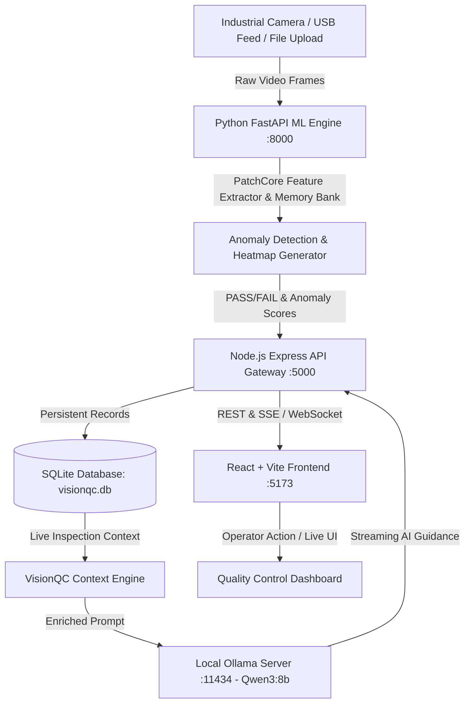

# VisionQC — Next-Gen AI Visual Quality Inspection Platform

[](https://github.com/rishik-123/VisionQC_Prototype_TechForge)
[](https://www.python.org/)
[](https://fastapi.tiangolo.com/)
[](https://react.dev/)
[](https://nodejs.org/)
[](https://ollama.com/)

**VisionQC** is an enterprise-grade AI computer vision and defect inspection system designed for high-throughput manufacturing lines. Combining **OpenCV edge streaming**, **PatchCore memory-bank anomaly detection (Anomalib)**, and a **local AI Copilot powered by Qwen3:8b**, VisionQC enables zero-defect automated quality assurance, instant anomaly localization heatmaps, and conversational root-cause analysis.

---

## 🌟 Key Features

- **⚡ Real-Time Live Scanner & Edge Vision**
  - Integrated OpenCV camera streaming with adaptive FPS and ROI frame grabber.
  - Sub-50ms inference per frame for high-speed conveyor belt operations.
  - Dynamic threshold slider with live PASS/FAIL defect boundary evaluation.

- **🔬 PatchCore Anomaly Localization & Heatmaps**
  - Few-shot unsupervised visual defect detection (trained solely on defect-free reference images).
  - Pixel-level anomaly score computation with spatial heatmap overlays (jet colormaps).
  - Out-of-the-box support for MVTec AD standard categories (Bottle, Capsule, Cable, Zipper, Metal Nut, etc.).

- **🤖 Autonomous Factory Copilot (Local LLM via Ollama)**
  - Local, zero-cloud data privacy powered by `qwen3:8b`.
  - Real-time factory context injection: queries live SQLite inspection logs, rejection trends, and failure categories.
  - Instant conversational root-cause diagnostics, batch summaries, and quality alerts.

- **📊 Comprehensive Analytics & Executive Reporting**
  - Interactive quality dashboards: defect rate trends, hourly throughput, yield percentages, and failure distributions.
  - Multi-format report export engine: Automated **PDF**, **Excel (.xlsx)**, and **CSV** quality audit sheets.
  - Detailed historical inspection logs with searchable filters and modal drill-down inspection inspection viewer.

- **🛡️ Enterprise Role & Configuration Management**
  - Operator, Supervisor, and Administrator role-based access control.
  - Dynamic camera configuration (resolution, RTSP/USB feed, exposure, lighting compensation).
  - Custom alert rules (audio triggers, email notifications, maintenance schedule tracking).

---

## 🏗️ System Architecture



---

## 📁 Repository Structure

```
VisionQC_Prototype_TechForge/
├── backend/
│   ├── config/                 # DB & environment configuration
│   ├── controllers/            # Express request handlers (Inspections, Models, Reports, Copilot)
│   ├── database/               # SQLite database initializer & schemas
│   ├── middleware/             # Authentication, error handling & upload middleware
│   ├── models/                 # Data model abstractions (User, Inspection, Alert, Model)
│   ├── python_service/         # FastAPI ML service
│   │   ├── main.py             # FastAPI entrypoint (:8000)
│   │   ├── patchcore_model.py  # PatchCore anomaly detection engine
│   │   ├── image_processor.py  # OpenCV filtering & heatmap visualization
│   │   ├── reference_database.py # Baseline feature embeddings
│   │   └── requirements.txt    # Python ML dependencies
│   ├── routes/                 # Express API route definitions
│   ├── services/               # Background services (Ollama, PDF/Excel exporters, Alert engine)
│   │   ├── ollamaService.js    # Optimized Qwen3:8b LLM connector
│   │   └── visionqcContext.js  # Live SQLite factory context extractor
│   └── server.js               # Node.js Express server entrypoint (:5000)
├── Frotnend/
│   ├── public/                 # Favicons and static SVGs
│   ├── src/
│   │   ├── components/         # Reusable UI components (Inspection, Copilot, Heatmaps, Analytics)
│   │   ├── context/            # React Auth, Inspection, Model, and Settings context providers
│   │   ├── hooks/              # Custom hooks (useCamera, useCopilot, useToast, useInspection)
│   │   ├── pages/              # Primary views (Dashboard, LiveInspection, Training, History, Reports)
│   │   ├── services/           # Axios frontend API services
│   │   ├── styles/             # Modular CSS design system & global styling tokens
│   │   ├── App.jsx             # React router & main application shell
│   │   └── main.jsx            # React root entry
│   ├── index.html              # HTML5 template
│   ├── package.json            # Frontend dependencies
│   └── vite.config.js          # Vite build configuration
├── models/
│   └── product_models/         # Pre-configured metadata and threshold configs for MVTec categories
├── runcommands.txt             # Quick execution cheat sheet
├── .gitignore                  # Optimized gitignore for large model weights & datasets
└── README.md                   # Project documentation
```

---

## 🚀 Quick Start Guide

### 1. Prerequisites
- **Node.js**: `v18.x` or higher
- **Python**: `3.10` – `3.12` (recommended)
- **Ollama**: Installed and running locally ([ollama.com](https://ollama.com/))
- **Git**: Installed

---

### 2. Installation & Setup

#### A. Python Machine Learning Service
```powershell
# Create & activate a Python virtual environment
python -m venv .venv
.\.venv\Scripts\Activate.ps1

# Install Python requirements
pip install -r backend/python_service/requirements.txt
```

#### B. Node.js Express Backend
```powershell
cd backend
npm install
```

#### C. React Frontend UI
```powershell
cd ../Frotnend
npm install
```

#### D. Pull AI Copilot Model
```powershell
ollama pull qwen3:8b
```

---

## 🏃 Running the Application

To run the complete platform, launch the following 4 services across separate terminal tabs:

| Service | Directory / Command | Port | Description |
| :--- | :--- | :--- | :--- |
| **1. ML Service** | `uvicorn main:app --app-dir backend/python_service --host 0.0.0.0 --port 8000 --reload` | `8000` | FastAPI Real-time PatchCore ML Engine |
| **2. Backend Gateway**| `cd backend; node --watch server.js` | `5000` | Express REST API & SQLite Gateway |
| **3. Frontend UI** | `cd Frotnend; npm run dev` | `5173` | React 18 / Vite Interactive Dashboard |
| **4. AI Copilot** | `ollama run qwen3:8b` | `11434`| Local High-Speed LLM Inference |

Once launched, navigate to:
👉 **`http://localhost:5173`**

---

## 🔌 API Overview

### ML Engine (`http://localhost:8000`)
- `POST /inspect` — Run PatchCore inference on uploaded image frame (returns anomaly score, PASS/FAIL, and base64 heatmap).
- `POST /train` — Train memory bank on a set of baseline golden reference images.
- `GET /health` — Real-time health and GPU/CPU resource monitor.

### Backend Gateway (`http://localhost:5000/api`)
- `GET /api/inspections` — Retrieve paginated historical inspection logs.
- `POST /api/inspections` — Store inspection result, confidence metrics, and defect mask.
- `POST /api/copilot/chat` — Factory-aware conversational QA using `qwen3:8b` with live database context.
- `GET /api/reports/export/:format` — Download report in `pdf`, `xlsx`, or `csv`.
- `GET /api/models` — List active product models and calibrated thresholds.

---

## ⚙️ Environment Configuration

### Backend (`backend/.env`)
```env
PORT=5000
PYTHON_SERVICE_URL=http://127.0.0.1:8000
OLLAMA_BASE_URL=http://127.0.0.1:11434
OLLAMA_MODEL=qwen3:8b
JWT_SECRET=visionqc_super_secret_jwt_key_2026
DATABASE_PATH=./database/visionqc.db
```

### Frontend (`Frotnend/.env`)
```env
VITE_API_BASE_URL=http://localhost:5000/api
```

---

## 🛠️ Technology Stack

| Layer | Technologies |
| :--- | :--- |
| **Frontend** | React 18, Vite, Lucide Icons, Chart.js, HTML5 Canvas, Vanilla CSS3 Design System |
| **Backend Gateway** | Node.js, Express.js, SQLite3 / Better-SQLite3, PDFKit, ExcelJS |
| **Machine Learning** | Python 3, PyTorch, Anomalib, PatchCore, OpenCV, FastAPI, Uvicorn, NumPy, SciPy |
| **AI Copilot** | Ollama, Qwen3 (8B Parameters), SQLite Factory Context Injection |

---

## ⚠️ Limitations

- **2D Surface & Single-Angle Orientation**: Current inspection pipelines focus on 2D visual anomaly detection. Complex 3D volumetric flaws or multi-faceted parts require calibrated multi-camera synchronization.
- **Lighting & Optical Variance Sensitivity**: Like all visual inspection systems, severe ambient light fluctuations, glare, or motion blur can shift feature distributions without controlled industrial illumination (e.g., dome/ring lights).
- **Edge Compute & VRAM Demands**: Concurrent execution of real-time PatchCore visual feature extraction and the local `qwen3:8b` AI Copilot achieves peak throughput on systems equipped with dedicated GPU acceleration (>= 8GB VRAM).
- **Memory Bank Scaling**: Highly diverse product surfaces with massive golden sample sets require coreset subsampling to prevent elevated inference latency and memory footprints.

---

## 🔮 Future Scope & Roadmap

- **Multi-Camera & 3D Point Cloud Anomaly Detection**: Expanding the inspection pipeline to multi-angle camera feeds and 3D surface scanning for all-round defect localization.
- **Industrial PLC & SCADA Integration**: Native edge protocol support (OPC-UA, Modbus TCP, MQTT) to directly trigger physical pneumatic rejection arms and conveyer sorters.
- **Active Online Continual Learning**: Dynamic memory-bank fine-tuning and active human-in-the-loop feedback directly from operator corrections on the line.
- **Embedded Edge Deployment & Model Quantization**: Exporting PatchCore and feature extractors via ONNX / TensorRT for ultra-low-power edge deployment on NVIDIA Jetson Orin and industrial SBCs.
- **Multi-Modal Vision-Language Copilot**: Integrating Vision-Language Models (VLMs) for direct image-based defect reasoning, conversational defect classification, and automated corrective action generation.

---

## 👥 Team Members

- **Rishik Jariwala**
- **Devam Pithadia**

---
## Team name
- **CodeCrusaders**

## 📄 License & Attribution
Developed for **TechForge VisionQC** manufacturing automation and defect intelligence.  
Distributed under the **MIT License**.
